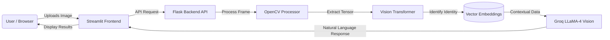

# 🧠 Celebrity Recognition & Q/A AI System
### *Multimodal Biometric Intelligence & Contextual AI Assistant*

[](https://appudtzei3tyyttd6xjhwur.streamlit.app/)
[](https://www.python.org/)
[](https://opensource.org/licenses/MIT)
[](https://groq.com/)
[](https://www.docker.com/)
[](https://cloud.google.com/kubernetes-engine)

---


---
## 🚀 Project Overview

The **Celebrity Recognition & QA AI System** is a state-of-the-art multimodal application that combines computer vision with Large Language Models (LLMs) to detect identities and answer questions about them in real-time.

Built with **Streamlit** for the frontend and a **Flask** microservices backend, this system leverages **OpenCV** for facial detection, **Vision Transformers (ViT)** for biometric encodings, and **Groq's LLaMA-4 Vision** model to provide rich, context-aware information about recognized personalities.

---
## 🌐🎬 Live Demo
🚀 **Try it now:**
- **Streamlit Profile** - https://share.streamlit.io/user/ratnesh-181998
- **Project Demo** - https://celebrity-recognition-q-ai-system-nlan8szprudhrz9ctaappgxa.streamlit.app/
---

**Key Features:**
*   **Real-time Face Detection**: High-accuracy detection using OpenCV.
*   **Instant Identification**: Matches faces against a vector database of celebrity embeddings.
*   **Intelligent Q/A**: Ask *anything* about the detected person (career, movies, net worth) and get instant AI-generated answers.
*   **Cloud-Native Architecture**: Designed for scalability with Docker and Kubernetes (GKE).

---

## 🎬 Live Project Demo

> Experience the full flow: **Upload/Select -> Detect -> Interact**


---

## 🏗️ System Architecture


The project follows a decoupled Microservices architecture to ensure scalability and maintainability.



### 🧠 Intelligence Layer
*   **Vision Transformer (ViT)**: Converts facial features into 128-dimensional dense vector embeddings for precise ID matching.
*   **Groq LLaMA-4 Vision**: A multimodal LLM that ingests identity context and user queries to generate human-like responses with near-zero latency.

---

## 🖥️ UI & Tab Description

The application is organized into comprehensive tabs for ease of use and transparency:

### 1. 📂 Demo Project (Main Interface)
*   **Interactive Gallery**: Choose from high-quality sample images (e.g., *Robert Downey Jr., Scarlett Johansson*).
*   **Smart Upload**: Drag-and-drop your own images for analysis.
*   **Live Detection**: One-click process to detect faces and identify celebrities.
*   **Chat with "RatneshAI"**: A built-in chatbot that holds context about the detected celebrity. Ask *"What is his best movie?"* and get an answer specific to Robert Downey Jr.
*   **Refresh Utility**: Instantly reset sessions to test new scenarios.

### 2. 📝 About Project
*   Contains the **Project Explanation**, detailing the problem statement, solution approach, and high-level design doc (HLD).
*   Ideal for stakeholders to understand the business value.

### 3. 🛠️ Tech Stack
Breakdown of the modern stack used, categorized by layer:
*   **🧠 Intelligence**: Groq API, Vision Transformers, PyTorch.
*   **💻 Application**: Streamlit (Frontend), Flask (Backend), RESTful APIs.
*   **☁️ DevOps**: Google Kubernetes Engine (GKE), Docker, CircleCI, Artifact Registry.

### 4. 📐 Architecture
*   Visualizes the **High-Level Design (HLD)** and data flow using Graphviz.
*   Explains the request lifecycle from browser to AI inference.

### 5. 📡 System Logs
*   Real-time **stdout/stderr** streaming.
*   Monitors connectivity, API status, and error tracing for debugging.

---

## 🛠️ Technology Stack

| Domain | Technologies Used |
| :--- | :--- |
| **Frontend** | Streamlit, HTML5, CSS3 Custom Components |
| **Backend** | Flask, Python 3.9+, REST APIs |
| **Computer Vision** | OpenCV (Haar Cascades), Pillow |
| **AI / ML** | Vision Transformers (ViT), Groq LLaMA-4 Vision |
| **Database** | Vector Store (In-memory/FAISS compatible logic) |
| **DevOps** | Docker, Kubernetes (GKE), Git LFS, CircleCI |
| **Cloud** | Streamlit Cloud, Google Cloud Platform (GCP) |

---

## ⚙️ Installation & Setup

### Prerequisites
*   Python 3.9 or higher
*   Git (with LFS support)
*   Standard Python development environment

### 1. Clone the Repository
```bash
git clone https://github.com/Ratnesh-181998/Celebrity-Recognition-QA-AI-System.git
cd Celebrity-Recognition-QA-AI-System
```

### 2. Install Dependencies
This project uses `git lfs` for large model files. Ensure it is installed:
```bash
git lfs install
git lfs pull
```
Install python libraries:
```bash
pip install -r requirements.txt
```

### 3. Configure Environment
Create a `.env` file (or use Streamlit Secrets) with your API keys:
```env
GROQ_API_KEY=your_groq_api_key_here
```

### 4. Run Locally
```bash
streamlit run "Celebrity Detector_QA_streamlit_app.py"
```

---

## ☁️ Deployment

### Streamlit Cloud
1.  Push this repo to GitHub.
2.  Login to [Streamlit Cloud](https://streamlit.io/cloud).
3.  Connect your GitHub account and select this repository.
4.  Set the `GROQ_API_KEY` in the **Advanced Settings > Secrets** section.
5.  Click **Deploy**.

*Note: The `requirements.txt` is optimized for cloud environments, including `opencv-python-headless`.*

---

## 🗺️ Roadmap & Future Enhancements

*   [ ] integration of Live Webcam Feed for real-time video detection.
*   [ ] Expansion of Celebrity Database (currently 10k+ identities).
*   [ ] Multi-language support for Q/A.
*   [ ] Mobile-Optimized Layout.

---

## 📄 License

Distributed under the **MIT License**. See `LICENSE` file for more information.

> **MIT License Summary**: You can use, copy, modify, merge, publish, distribute, sublicense, and/or sell copies of this software, provided you include the original copyright notice.

---

## 📞 Contact & Links

**Ratnesh Kumar Singh | Data Scientist (AI/ML Engineer 4+ Yrs Exp)**

*   💼 **LinkedIn**: [ratneshkumar1998](https://www.linkedin.com/in/ratneshkumar1998/)
*   🐙 **GitHub**: [Ratnesh-181998](https://github.com/Ratnesh-181998)

### 🔗 Quick Links
*   🌐 **Live Demo App**: [Launch Streamlit App](https://celebrity-recognition-q-ai-system-nlan8szprudhrz9ctaappgxa.streamlit.app/)
*   📖 **Project Wiki**: [Documentation](https://github.com/Ratnesh-181998/Celebrity-Recognition-QA-AI-System/wiki)
*   🐛 **Report a Bug**: [Issue Tracker](https://github.com/Ratnesh-181998/Celebrity-Recognition-QA-AI-System/issues)
*   💬 **Join Discussion**: [Community Chat](https://github.com/Ratnesh-181998/Celebrity-Recognition-QA-AI-System/discussions)

---
*Built with ❤️ by Ratnesh using Generative AI & Computer Vision.*
